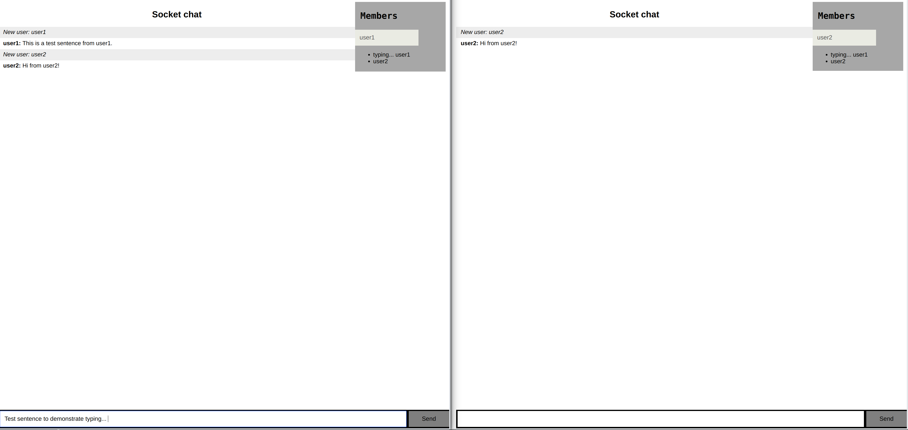

# socket-chat
The app is a feature added improvement of the the basic app on the socket.io website.

### Setting up
1. git clone or download the repo.
2. Install node modules.
```
npm install
```
3. Run the app.
```
node index.js

```
4. Served at localhost:8080.

### Feels!
The basic UI of the app looks like this!

